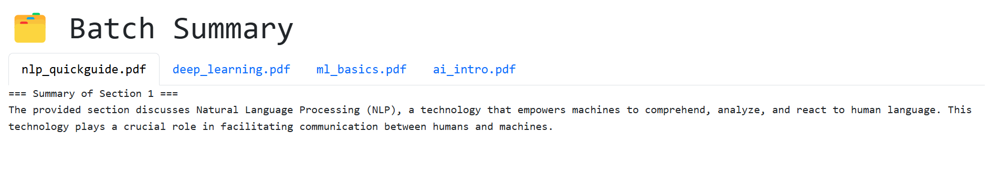

# 🧠 JCAP AI Paper Summarizer

An AI-powered web application that summarizes research papers using [Ollama](https://ollama.com/) and local LLMs like **Mistral**.

Supports:
- ✅ Single PDF summarization
- ✅ Batch ZIP upload of multiple PDFs
- ✅ Parallelized chunk processing
- ✅ Web-based interface with velvet-blue theming

> This is a frontend interface only. It requires a running Ollama backend.

---

## 🚀 Features

| Feature              | Description                                 |
|----------------------|---------------------------------------------|
| 🔍 PDF Parsing        | Extracts and chunks full paper text         |
| 🧠 LLM Summarization  | Sends chunked text to Ollama (Mistral)      |
| 📁 ZIP Upload         | Summarize multiple PDFs at once             |
| ⚡ Parallel Processing | Threads summarization for speed            |
| 💾 Download           | Save summary as `.txt`                      |
| 🌈 Themed UI          | Inspired by Velvet Room / Persona aesthetic |

---

---

## 🖼️ Screenshots

### 🧠 Main Interface

Upload a single PDF or a batch of papers as a `.zip`:

  

---

### 📄 Batch Summary Results

Each PDF is summarized in its own tab with section breakdowns:

  

## 📦 Project Structure

JCAP_AI_Paper_Summarizer/ ├── app.py # Flask app ├── requirements.txt ├── Dockerfile # Dockerfile for frontend (Flask) ├── ollama-backend/
│ └── Dockerfile # Dockerfile to host Ollama server ├── templates/ # HTML templates ├── static/ # Custom CSS styles │ └── style.css

---

## 📂 Requirements

- Python 3.11+
- [Ollama](https://ollama.com/) running and serving models
- Models: `mistral`, `llama3`, etc.

---

## 🔧 Local Dev Setup

### 1. Create virtual environment

in bash run 
python3 -m venv venv
source venv/bin/activate

2. Install dependencies

pip install -r requirements.txt

3. Start Flask server
python3 app.py
App runs at:
http://localhost:8080

☁️ Cloud Deployment
✅ Frontend: Flask via Cloud Run
Make sure Ollama is running and publicly accessible.

Build and deploy:

gcloud run deploy jcap-summarizer \
  --source . \
  --platform managed \
  --region us-central1 \
  --allow-unauthenticated

Cloud Run will build from the included Dockerfile.
🧠 Ollama Backend (Required)
This app requires an external Ollama backend running at:

http://<YOUR_OLLAMA_HOST>:11434/api/generate
✳️ Option A: Run Locally
curl -fsSL https://ollama.com/install.sh | sh
ollama serve
ollama pull mistral
✳️ Option B: Run in Docker (Remote or Local)

cd ollama-backend
docker build -t ollama-server .
docker run -d -p 11434:11434 ollama-server
Ollama must be running before deploying the Flask app.

🔒 Production Notes
Ollama backend must be secured if deployed publicly (add HTTPS/auth/reverse proxy).

Cloud Run app expects Ollama at a static IP or domain.

For professional use, we recommend deploying Ollama on:

A GCE VM

A private VPS

Your own server

📄 License
MIT

